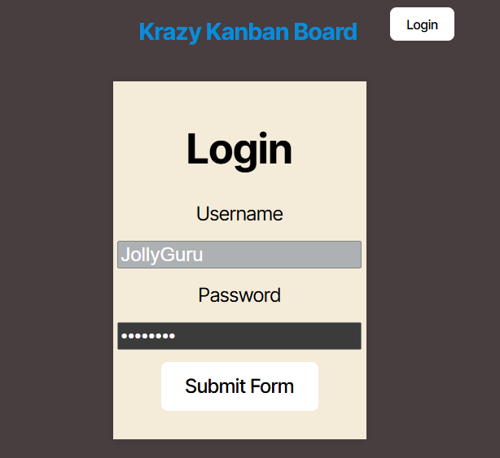
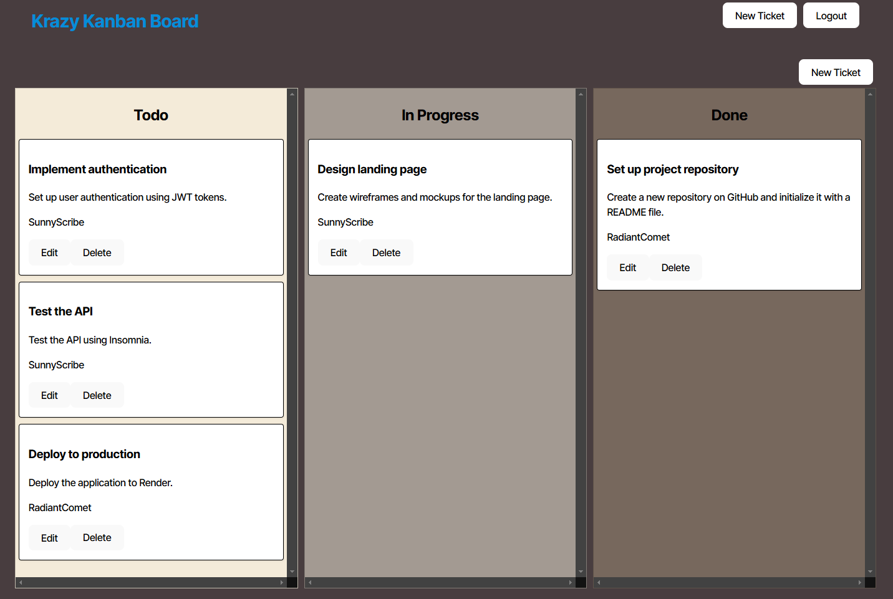
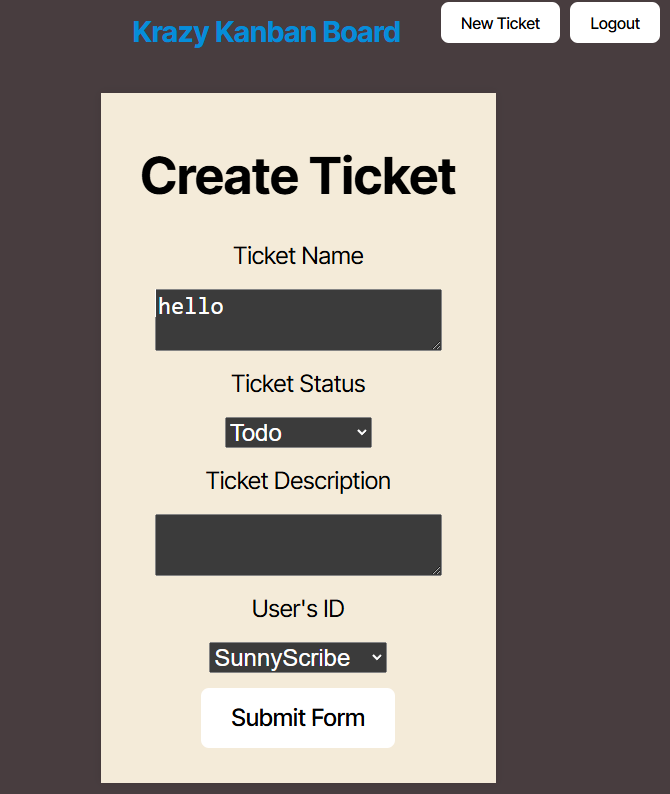

# Kanban Clarity

## Description

This project is a kanban board application where a user can login and create tickets and place them in categories. Once they create a ticket they have the ability to move the tickets into the category that fits where it is in the project phases.

## Table of Contents

- [GitHub Repository](#github-repository)
- [Preview](#preview)
<!-- - [Credits](#credits) -->
- [License](#license)
- [How to Contribute](#how-to-contribute)
- [Questions](#questions)

## Github Repository

[GitHub Repository](https://github.com/Liv-5/Kanban-Clarity)

## Preview

<!-- 

 -->

## Deployed Webpage

[Deployed Link](https://kanban-clarity.onrender.com/)

<!-- ## Credits -->

## License

This project is licensed under [MIT](https://opensource.org/licenses/MIT)

## How to Contribute

You can contact me if you would like to contribute

## Questions

If you have any questions regarding this project you can email me at, [ osmith5@kent.edu](mailto:osmith5@kent.edu) or go to my [Github](https://github.com/Liv-5)
